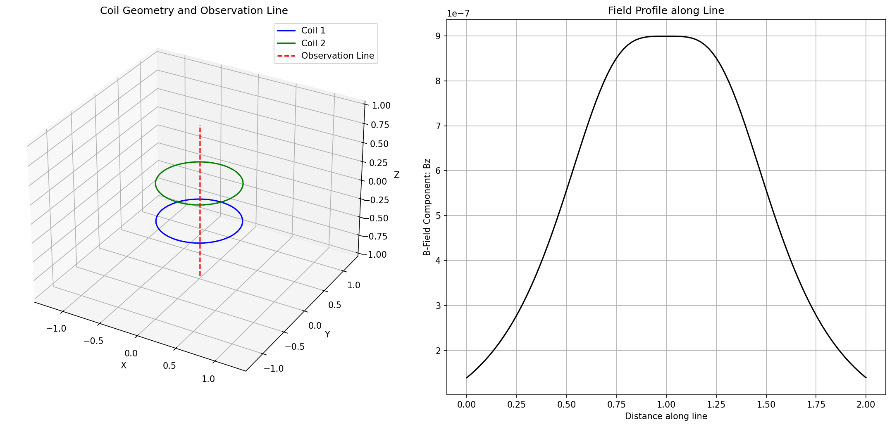

# em_app: Electromagnetic Simulation Platform

[](https://opensource.org/licenses/MIT)
[](https://github.com/shashi-manikonda/em-simulation-platform)

An electromagnetic simulation platform designed for calculating and visualizing magnetic fields from various current-carrying structures.



## Description

`em_app` is a Python package that provides a powerful and flexible platform for simulating electromagnetic phenomena. It specializes in the calculation of magnetic fields generated by current-carrying wires and coils. The package is designed to be both accurate and easy to use, making it suitable for both educational and research purposes.

## Features

- **Precise Field Calculations:** Utilizes Multivariate Taylor Functions (MTFs) to achieve high-precision magnetic field calculations.
- **Flexible Coil Geometries:** Supports various coil geometries, including rings, rectangular coils, and straight wires.
- **Powerful Visualization:** Includes built-in methods for visualizing magnetic fields in 1D, 2D, and 3D, helping you to better understand the field patterns.
- **Extensible Backend:** Supports multiple backends for the Biot-Savart calculations, including pure Python, C++, and C, allowing you to choose the best option for your needs.

## Installation

To get started with `em_app`, you'll need to have Python and git installed on your system. Then, you can install the package directly from the GitHub repository:

```bash
git clone https://github.com/shashi-manikonda/em-simulation-platform.git
cd em-simulation-platform
pip install .
```

## Usage

Here's a simple example of how to use `em_app` to calculate and plot the magnetic field from a circular coil:

```python
import numpy as np
from em_app.currentcoils import RingCoil

# Define the coil parameters
current = 1.0  # Amperes
radius = 0.05  # meters
num_segments = 40
center = np.array([0, 0, 0])
axis = np.array([0, 0, 1])

# Create a RingCoil object
my_coil = RingCoil(current, radius, num_segments, center, axis)

# Define the points where you want to calculate the field
field_points = np.array([[0, 0, z] for z in np.linspace(-0.1, 0.1, 20)])

# Calculate the magnetic field
b_field = my_coil.biot_savart(field_points)

# Get the numerical field vectors
_, b_vectors = b_field._get_numerical_data()

# Print the results
for point, vector in zip(field_points, b_vectors):
    print(f"Point: {point}, B-Field: {vector}")

# Plot the coil and its magnetic field
my_coil.plot_field_vectors_3d()
```

## Contributing

Contributions are welcome! If you'd like to contribute to the project, please see our [CONTRIBUTING.md](CONTRIBUTING.md) file for more information.

## License

This project is licensed under the MIT License. See the [LICENSE](LICENSE) file for details.
