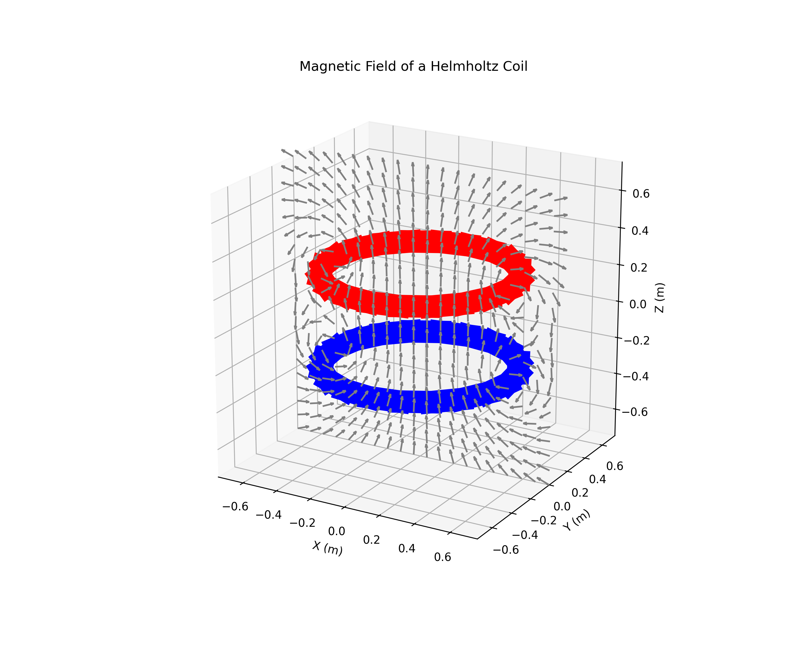

# em-simulation-platform

[](https://em-app.readthedocs.io/en/latest/?badge=latest)

EM simulation tools for electromagnetic field analysis, visualization, and benchmarking.

## Features
- Modular solvers for EM field calculations
- Source modeling (dipoles, wires, loops, solenoids)
- Advanced plotting and visualization
- Demo scripts for validation and exploration
- Benchmarking utilities
- Extensible architecture for research and teaching

## Installation

```bash
# Clone the repository
git clone https://github.com/shashi-manikonda/em-simulation-platform.git
cd em-simulation-platform

# (Recommended) Create a virtual environment
python3 -m venv .mtfvenv
source .mtfvenv/bin/activate

# Install dependencies
pip install -r requirements.txt
```

## Usage

### Run all demos
```bash
python run_all_demos.py
```

### Run a specific demo
```bash
python demos/em/01_validation_demo.py
```

### Run tests
```bash
pytest
```

## Building the Documentation

This project uses Sphinx to generate API documentation from the source code.

### Prerequisites

First, install the documentation-specific dependencies:

```bash
pip install -r docs/requirements.txt
```

### Build Script

A helper script is provided to simplify the build process. To build the documentation, run the following command from the project root:

```bash
./docs/build_docs.sh
```

The script will clean the previous build and generate the HTML documentation in the `docs/_build/html` directory.

### Viewing the Documentation

To view the documentation, open the `docs/_build/html/index.html` file in your web browser.

## Example: Calculate and Plot Magnetic Field of a Dipole
```python
from src.em_app.sources import Dipole
from src.em_app.plotting import plot_field

# initialize mtf
mtf.initialize_mtf(max_order=6, max_dimension=4)

# Create a dipole source
source = Dipole(position=[0,0,0], moment=[0,0,1])

# Calculate field at grid points
field = source.calculate_field(grid_points)

# Plot the field
plot_field(field)
```

## Live Demo: Helmholtz Coil
This demo calculates and visualizes the magnetic field of a Helmholtz coil, a device used to produce a region of nearly uniform magnetic field. The script `demos/em/helmholtz_coil_demo.py` generates the plot below.

```python
import numpy as np
import matplotlib.pyplot as plt
from em_app.sources import RingCoil
from em_app.solvers import calculate_b_field
from em_app.vector_fields import VectorField
from mtflib import mtf

# Initialize the MTF library
# The 4th dimension is used for numerical integration along the segments.
mtf.initialize_mtf(max_order=1, max_dimension=4)

# --- 1. Setup the Helmholtz Coil Geometry ---
radius = 0.5  # meters
separation = radius
current = 1.0  # Amperes
num_segments = 20

# Create the two coils
coil1 = RingCoil(
    current=current,
    radius=radius,
    num_segments=num_segments,
    center_point=np.array([0, 0, -separation / 2]),
    axis_direction=np.array([0, 0, 1]),
)
coil2 = RingCoil(
    current=current,
    radius=radius,
    num_segments=num_segments,
    center_point=np.array([0, 0, separation / 2]),
    axis_direction=np.array([0, 0, 1]),
)

# --- 2. Define the Field Points for Calculation ---
grid_size = 1.5 * radius
num_points = 20
x_points = np.linspace(-grid_size, grid_size, num_points)
z_points = np.linspace(-grid_size, grid_size, num_points)
X, Z = np.meshgrid(x_points, z_points)
field_points = np.vstack([X.ravel(), np.zeros_like(X.ravel()), Z.ravel()]).T

# --- 3. Calculate and Combine the Magnetic Fields ---
b_field1 = calculate_b_field(coil1, field_points)
b_field2 = calculate_b_field(coil2, field_points)
total_b_vectors = b_field1._vectors_mtf + b_field2._vectors_mtf
total_b_field = VectorField(vectors=total_b_vectors, field_points=field_points)
b_vectors = np.array([b.to_numpy_array() for b in total_b_field._vectors_mtf])

# --- 4. Plot the Results ---
fig = plt.figure(figsize=(10, 8))
ax = fig.add_subplot(111, projection="3d")
coil1.plot(ax, color="b", wire_thickness=0.02)
coil2.plot(ax, color="r", wire_thickness=0.02)
ax.quiver(
    field_points[:, 0], field_points[:, 1], field_points[:, 2],
    b_vectors[:, 0], b_vectors[:, 1], b_vectors[:, 2],
    length=grid_size * 0.1, normalize=True, color="gray",
)
```

### Output



## Project Structure
- `src/em_app/` - Core library modules
- `demos/em/` - Demo scripts
- `benchmarks/` - Performance and accuracy benchmarks
- `tests/` - Unit tests

## License
MIT
